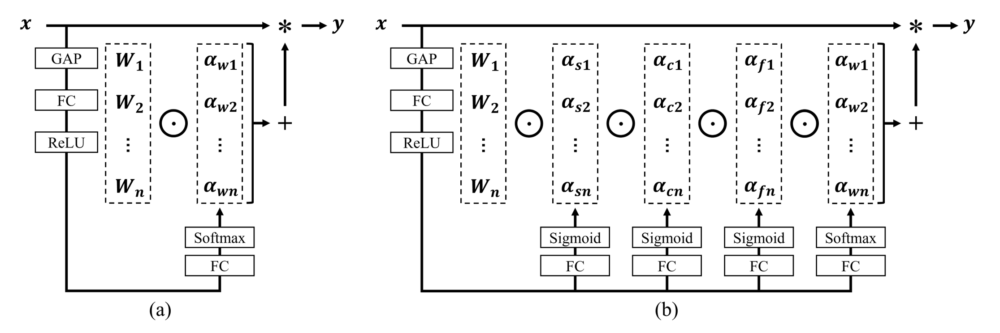
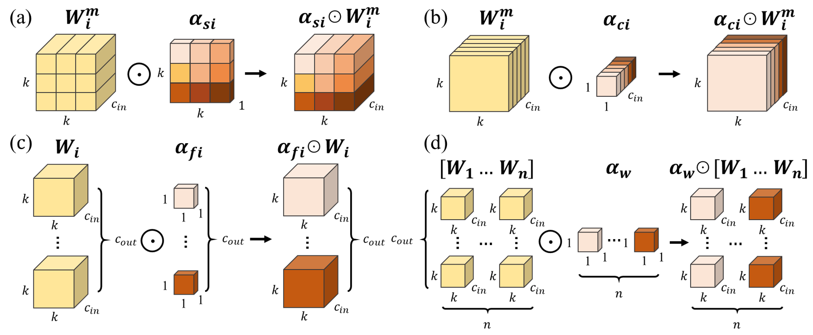

# Omni-Dimensional Dynamic Convolution

By Chao Li, Aojun Zhou and Anbang Yao.

This repository is an official PyTorch implementation of ["Omni-Dimensional Dynamic Convolution", ODConv for short](https://openreview.net/pdf?id=DmpCfq6Mg39), published by ICLR 2022 as a spotlight. ODConv is a more generalized yet elegant dynamic convolution design, which leverages a novel multi-dimensional attention mechanism with a parallel strategy to learn complementary attentions for convolutional kernels along all four dimensions (namely, the spatial size, the input channel number and the output channel number for each convolutional kernel, and the convolutional kernel number) of the kernel space at any convolutional layer. As a drop-in replacement of regular convolutions, ODConv can be plugged into many CNN architectures. Basic experiments are conducted on the [ImageNet](http://www.image-net.org) benchmark, and downstream experiments are conducted on the [MS-COCO](https://cocodataset.org/#home) benchmark.

<p align="center"></p>
A schematic comparison of (a) DyConv (CondConv uses GAP+FC+Sigmoid) and (b) ODConv. Unlike CondConv and DyConv which compute a single attention scalar $α_{wi}$ for the convolutional kernel $W_{i}$, ODConv leverages a novel multi-dimensional attention mechanism to compute four types of attentions $α_{si}$, $α_{ci}$, $α_{fi}$ and $α_{wi}$ for $W_{i}$ along all four dimensions of the kernel space in a parallel manner.

<p align="center"></p>
Illustration of multiplying four types of attentions in ODConv to convolutional kernels progressively. (a) Location-wise multiplication operations along the spatial dimension, (b) channel-wise multiplication operations along the input channel dimension, (c) filter-wise multiplication operations along the output channel dimension, and (d) kernel-wise multiplication operations along the kernel dimension of the convolutional kernel space.


## Dataset

Following [this repository](https://github.com/pytorch/examples/tree/master/imagenet#requirements),
- Download the ImageNet dataset from http://www.image-net.org/.
- Then, move and extract the training and validation images to labeled subfolders, using [the following script](https://github.com/pytorch/examples/blob/main/imagenet/extract_ILSVRC.sh).


## Requirements

- Python >= 3.7.0
- PyTorch >= 1.8.1
- torchvision >= 0.9.1


## Updates

- 2022/09/16 Code and trained models of ResNet family and MobileNetV2 family with ODConv for classification and detection are released.
- 2022/10/31 Add Baidu Netdisk download links.

## Results and Models

**Note**: The models released here show slightly different (**mostly better**) accuracies compared to the original models reported in our paper. As the original models and source code had been used in internal commerical projects. This reimplementation of training and evaluation code is dedicated for public release.   

Results comparison on the ImageNet validation set with the MobileNetV2 (1.0×, 0.75×, 0.5×) backbones trained for 150 epochs. For our ODConv, we set r = 1/16.


|  Models  |  Params  |  Madds  |  Top-1 Acc(%)  |  Top-5 Acc(%) |  Google Drive  |  Baidu Netdisk  |
|:---------- |:-------------:|:-------------:|:-------------:|:-------------:|:-------------:|:-------------:|
| MobileNetV2 (1.0×) | 3.50M | 300.8M | 71.65 | 90.22 |  [model](https://drive.google.com/file/d/1bcqVXDLqHW3cid4eMZ_992QHBRMalrMZ/view?usp=sharing)| [model](https://pan.baidu.com/s/17xO6tntogopKPv_mV3W_6w?pwd=suen)|
| + ODConv (1×) | 4.94M | 311.8M | 74.74 | 91.95 |  [model](https://drive.google.com/file/d/1Du_AH_pvtFE8ABg_FLjtPccVypw5AajU/view?usp=sharing)| [model](https://pan.baidu.com/s/1ji5Dwke4lf4hOqH7tzpvbA?pwd=w9eb)|
| + ODConv (4×) | 11.51M | 327.1M | 75.29 | 92.18 |  [model](https://drive.google.com/file/d/1HfwoBWOGsiiuhoOyetoQeJ8iXrCi5lJv/view?usp=sharing)| [model](https://pan.baidu.com/s/183DH5PPgOXUhtWF3F4cqUA?pwd=ufx9)|
| MobileNetV2 (0.75×) | 2.64M | 209.1M | 69.18 | 88.82 |  [model](https://drive.google.com/file/d/1skF04XZ-chidb9ryQy5AnogCZ4PCC9P1/view?usp=sharing)| [model](https://pan.baidu.com/s/1IGIlJH-J_c7XYlwYWgLlhQ?pwd=cb7q)|
| + ODConv (1×) | 3.51M | 217.1M | 72.71 | 90.85 |  [model](https://drive.google.com/file/d/1g3_OppE5jXW5eO7jy2vbw9mfVqNz-_Tk/view?usp=sharing)| [model](https://pan.baidu.com/s/1w2anG3IZxdm4_NOdoCMlbg?pwd=mb3x)|
| + ODConv (4×) | 7.50M | 226.3M | 74.01 | 91.37 |  [model](https://drive.google.com/file/d/1bGloR4WUAsGEQpbmqLO-hShIcoV0ut42/view?usp=sharing)| [model](https://pan.baidu.com/s/1NR4RUPZ6Ju1unCj4L6p76g?pwd=j7qi)|
| MobileNetV2 (0.5×) | 1.97M | 97.1M | 64.30 | 85.21 |  [model](https://drive.google.com/file/d/18ehlfZCMKSB-BNFhzyTFg0UCceaX76-t/view?usp=sharing)| [model](https://pan.baidu.com/s/1fF9enXKjXVDZiI2vbPV8kg?pwd=32ei)|
| + ODConv (1×) | 2.43M | 101.8M | 68.06 | 87.67 |  [model](https://drive.google.com/file/d/137qpjBdLjQ6MNNQ-YbqgWZeTEAq7AM_2/view?usp=sharing)| [model](https://pan.baidu.com/s/1vuWkxbCjouSwhZVIwQq--A?pwd=sm5p)|
| + ODConv (4×) | 4.44M | 106.4M | 70.23 | 88.86 |  [model](https://drive.google.com/file/d/1x2bB8GxNAKfvO-_MX-9Z9mqABBfHkYed/view?usp=sharing)| [model](https://pan.baidu.com/s/12a8Tui8xerOZvJMJzj0_6Q?pwd=v53r)|

Results comparison on the ImageNet validation set with the ResNet18, ResNet50 and ResNet101 backbones trained for 100 epochs. For our ODConv, we set r = 1/16.

|  Models  |  Params  |  Madds  |  Top-1 Acc(%)  |  Top-5 Acc(%) |  Google Drive  |  Baidu Netdisk  |
|:---------- |:-------------:|:-------------:|:-------------:|:-------------:|:-------------:|:-------------:|
| ResNet18 | 11.69M | 1.814G | 70.25 | 89.38 |  [model](https://drive.google.com/file/d/10eYio_FYm0LpalEJ8PkW4_twXGcxF8Of/view?usp=sharing)| [model](https://pan.baidu.com/s/1oEbwLhkBZEkK6g87G5VepA?pwd=99fs)|
| + ODConv (1×) | 11.94M | 1.838G | 73.05 | 91.05 |  [model](https://drive.google.com/file/d/1AxCKAHJve3fbe2SnvoHsSucNvjv5Dxow/view?usp=sharing)| [model](https://pan.baidu.com/s/1s9czTBxBR_qV3nit17oChQ?pwd=v7kd)|
| + ODConv (4×) | 44.90M | 1.916G | 74.19 | 91.47 |  [model](https://drive.google.com/file/d/1Krsaa0fBKluFCyO7nmg-R9LlsoSUjJj2/view?usp=sharing)| [model](https://pan.baidu.com/s/1HqOBFQEHMHWVkSJjDKenSg?pwd=79qv)|
| ResNet50 | 25.56M | 3.858G | 76.23 | 92.97 |  [model](https://drive.google.com/file/d/1dFMbV1QkKQOain1_4JhAuHAW9Xq_ZzCS/view?usp=sharing)| [model](https://pan.baidu.com/s/1eYyrf6ay7QKwAvFzFKMiIg?pwd=he5m)|
| + ODConv (1×) | 28.64M | 3.916G | 77.87 | 93.77 |  [model](https://drive.google.com/file/d/1Aqwv6uQ9iI8a8Z5vjqmKuSTar0U8gfVJ/view?usp=sharing)| [model](https://pan.baidu.com/s/12muB86rIFW5Qquwx_gM0rA?pwd=rj2n)|
| + ODConv (4×) | 90.67M | 4.080G | 78.50 | 93.99 |  [model](https://drive.google.com/file/d/1uO774twnIYLiDV2BAsVM136k4EAhs6oh/view?usp=sharing)| [model](https://pan.baidu.com/s/1Xs-wlWpP2yiRZfsuTpvi-g?pwd=89ey)|
| ResNet101 | 44.55M | 7.570G | 77.44 | 93.68 |  [model](https://drive.google.com/file/d/1ECAeSTM7Z9DLe4LbWkUsd-WZqoLUYad2/view?usp=sharing)| [model](https://pan.baidu.com/s/1LJprEKbHNNY8OjmuIONB5w?pwd=b4s9)|
| + ODConv (1×) | 50.82M | 7.675G | 78.84 | 94.27 |  [model](https://drive.google.com/file/d/1PJNcrw2RP9xG-18gw2NE93mwVmQBIbeM/view?usp=sharing)| [model](https://pan.baidu.com/s/14ULFlOciDPNAVUfyRrc3Pw?pwd=brwk)|
| + ODConv (2×) | 90.44M | 7.802G | 79.15 | 94.34 |  [model](https://drive.google.com/file/d/1ph0woQfR2Ut2JfV4RKQPB6tAXf9pZmTo/view?usp=sharing)| [model](https://pan.baidu.com/s/16YVtiKbNztWc98GvGkMRrg?pwd=kudj)|


## Training

To train ResNet backbones:
```shell
python -m torch.distributed.launch --nproc_per_node={ngpus} main.py \
--arch {model name} --epochs 100 --lr 0.1 --wd 1e-4 --dropout {dropout rate} \
--lr-decay schedule --schedule 30 60 90 --kernel_num {number of kernels} --reduction {reduction ratio} \
--data {path to dataset} --checkpoint {path to checkpoint} 
```

For example, you can use following command to train ResNet18 with ODConv (4×, r=1/16):
```shell
python -m torch.distributed.launch --nproc_per_node=8 main.py \
--arch od_resnet18 --epochs 100 --lr 0.1 --wd 1e-4 --dropout 0.2 \
--lr-decay schedule --schedule 30 60 90 --kernel_num 4 --reduction 0.0625 \
--data ./datasets/ILSVRC2012 --checkpoint ./checkpoints/odconv4x_resnet18 
```

To train MobileNetV2 backbones:
```shell
python -m torch.distributed.launch --nproc_per_node={ngpus} main.py \
--arch {model name} --epochs 150 --lr 0.05 --wd 4e-5 --dropout {dropout rate} \
--lr-decay cos --kernel_num {number of kernels} --reduction {reduction ratio} \
--data {path to dataset} --checkpoint {path to checkpoint} 
```

For example, you can use following command to train MobileNetV2 (1.0×) with ODConv (4×, r=1/16):
```shell
python -m torch.distributed.launch --nproc_per_node=8 main.py \
--arch od_mobilenetv2_100 --epochs 150 --lr 0.05 --wd 4e-5 --dropout 0.2 \
--lr-decay cos --kernel_num 4 --reduction 0.0625 \
--data ./datasets/ILSVRC2012 --checkpoint ./checkpoints/odconv4x_mobilenetv2_100 
```

You can add **--use_amp** to enable Automatic Mixed Precision to reduce memory usage and speed up training.

## Evaluation

To evaluate a pre-trained model:
```shell
python -m torch.distributed.launch --nproc_per_node={ngpus} main.py \
--arch {model name} --kernel_num {number of kernels} \
--reduction {reduction ratio} --data {path to dataset} --evaluate \
--resume {path to model}
```

## Training and evaluation on downstream object detection

Please refer to **README.md** in the folder of [object_detection](object_detection) for details.


## Citation
If you find our work useful in your research, please consider citing:
```
@inproceedings{li2022odconv,
  title={Omni-Dimensional Dynamic Convolution},
  author={Chao Li and Aojun Zhou and Anbang Yao},
  booktitle={International Conference on Learning Representations},
  year={2022},
  url={https://openreview.net/forum?id=DmpCfq6Mg39}
}
```

## License

ODConv is released under the MIT license. We encourage use for both research and commercial purposes, as long as proper attribution is given. 

## Acknowledgment

This repository is built based on [mmdetection](https://github.com/open-mmlab/mmdetection), [Dynamic-convolution-Pytorch](https://github.com/kaijieshi7/Dynamic-convolution-Pytorch) repositories. We thank the authors for releasing their amazing codes.
